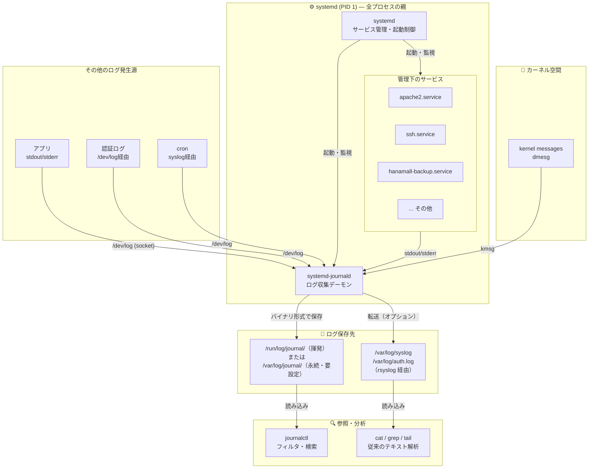

# Week03 課題 回答例・解説

---

### 大問1. 以下の要件でユーザーとグループを設定せよ

```bash
# グループ作成
sudo groupadd hanamall-dev

# ユーザー作成（ホームディレクトリ・シェル付き）
sudo useradd -m -s /bin/bash -G hanamall-dev suzuki

# パスワード設定
sudo passwd suzuki

# 確認
id suzuki
grep suzuki /etc/passwd
grep hanamall-dev /etc/group
```

**解説：**
- `-m`：ホームディレクトリ（`/home/suzuki`）を自動作成
- `-s /bin/bash`：ログインシェルを bash に設定
- `-G hanamall-dev`：追加グループに所属させる

---

### 大問2. yes > /dev/null & を3つ同時に起動し、top でCPU使用率が上昇することを確認してから全て kill せよ

```bash
# 3つ起動
yes > /dev/null &
yes > /dev/null &
yes > /dev/null &

# top で確認（q で終了）
top

# 方法1: pkill で一括停止
pkill yes

# 方法2: kill で個別停止
ps aux | grep yes
kill 1234 1235 1236   # PIDは実際の値に置き換える
```

**解説：**
- `pkill プロセス名`：名前でまとめて kill
- `kill PID`：PIDを指定して個別に停止

---

### 大問3. sudo grep "sudo" /var/log/auth.log で今日の sudo 実行履歴を確認し、「誰が・いつ・何のコマンドを実行したか」を表形式でまとめよ

```bash
sudo grep "COMMAND" /var/log/auth.log | tail -20
```

**出力例：**
```
May  1 10:05:23 server01 sudo: ubuntu : ... COMMAND=/usr/bin/apt update
May  1 10:10:11 server01 sudo: ubuntu : ... COMMAND=/usr/bin/systemctl restart apache2
```

| 時刻 | ユーザー | 実行コマンド |
|------|---------|------------|
| 10:05:23 | ubuntu | apt update |
| 10:10:11 | ubuntu | systemctl restart apache2 |

---

### 大問4. ps aux の出力から www-data ユーザーで動いているプロセスをすべて抽出し、それが何のサービスか答えよ

```bash
ps aux | grep www-data | grep -v grep
```

`www-data` は Apache の実行ユーザー。Web リクエストを処理するワーカープロセスが複数起動している。

---

### 大問5. systemctl list-units --type=service --state=failed を実行し、failed なサービスがあれば journalctl -u サービス名 -n 20 でエラーの原因を調べて報告せよ

```bash
systemctl list-units --type=service --state=failed
journalctl -u サービス名.service -n 20 --no-pager
```

**failed がない場合：** 「現在 failed 状態のサービスはなし。」

**調査ポイント：** ExecStart のパスのミス、設定ファイルの構文エラー、依存サービスの未起動など。

---

### 大問6. suzuki アカウントに切り替えて以下を確認せよ

```bash
sudo su - suzuki
pwd          # /home/suzuki が表示される
ls -la ~
sudo whoami  # → suzuki is not in the sudoers file.
exit
```

---

### 大問7. 思考問題: root 宛の SSH ログイン試行が1日に数千件。PermitRootLogin no だけでは安全と言えるか？さらに実施すべきセキュリティ対策を2つ挙げよ

**「安全とは言えない」**

理由：一般ユーザーへのブルートフォース攻撃は継続するため。sudo 権限ユーザーが突破されれば実質 root 相当の被害が発生する。

1. **パスワード認証を無効化する（`PasswordAuthentication no`）**  
   公開鍵認証のみにすることでブルートフォース攻撃自体を無効化できる。

2. **fail2ban を導入して自動IPブロックを行う**  
   一定回数失敗したIPを自動的にブロックし、大量試行を防ぐ。

---

## 📊 参考：systemd と journald の関係図



| 要素 | 役割 |
|------|------|
| **systemd (PID 1)** | 全サービスの親。起動・停止・監視を担う |
| **systemd-journald** | systemdの子サービス。全ログを一元収集する |
| **`/dev/log`** | アプリがログを書き込むソケット |
| **`/var/log/journal/`** | journaldのバイナリ保存先（`journalctl` でしか読めない） |
| **rsyslog経由** | 従来の `/var/log/syslog` へ転送する橋渡し役 |
