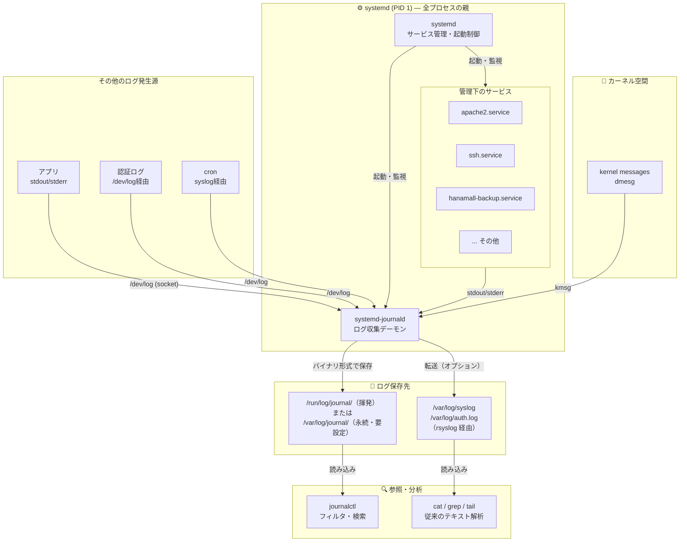

# Week03 課題 回答例・解説

---

### 大問1. 以下の要件でユーザーとグループを設定せよ

```bash
# ===== suzuki の設定 =====
# グループ作成
sudo groupadd dev_team

# ユーザー作成
sudo useradd -m -s /bin/bash suzuki
sudo passwd suzuki

# グループに追加
sudo usermod -aG dev_team suzuki

# sudo 権限を制限（apache2 の再起動のみ許可）
sudo visudo
# 末尾に以下を追加：
# suzuki ALL=(ALL) NOPASSWD: /usr/bin/systemctl restart apache2

# ===== yamada の設定 =====
# グループ作成
sudo groupadd viewers

# ユーザー作成（sudo 権限なし）
sudo useradd -m -s /bin/bash yamada
sudo passwd yamada
sudo usermod -aG viewers yamada

# ===== 確認 =====
id suzuki
id yamada
```

**出力例：**
```
uid=1002(suzuki) gid=1002(suzuki) groups=1002(suzuki),1003(dev_team)
uid=1003(yamada) gid=1004(yamada) groups=1004(yamada),1005(viewers)
```

---

### 大問2. yes > /dev/null & を3つ同時に起動し、top でCPU使用率が上昇することを確認してから全て kill せよ

> **注意：** `hands-on/03_user_process.sh` を実行済みの場合、スクリプトが既に `yes` プロセスを起動している。自分で起動する必要はなく、そのプロセスを特定して止める。

**Step1：top で高負荷プロセスを確認する**

```bash
top
```

`yes` が上位に並んでいることを確認（S列が `R`、%CPU が高い）。
`q` で top を終了する。

**Step2：ps で yes プロセスの PID を全て調べる**

```bash
ps aux | grep yes | grep -v grep
```

出力例：
```
root  12669  22.3  0.1  5684  2072 ?  R  03:20  6:53 yes
root  12670  22.3  0.1  5684  2072 ?  R  03:20  6:54 yes
root  12683  22.3  0.1  5684  2076 ?  R  03:22  5:48 yes
```

**Step3：pkill で一括停止**

```bash
pkill yes

# 停止を確認
ps aux | grep yes | grep -v grep
# → 何も表示されなければ停止完了
```

**Step4：個別に kill で止める（別の yes を再起動して試す場合）**

```bash
# 再起動して試す
yes > /dev/null &
yes > /dev/null &
yes > /dev/null &

# PID を確認して個別に kill
ps aux | grep yes | grep -v grep
kill 12669 12670 12683   # PIDは実際の値に置き換える

# 確認
ps aux | grep yes | grep -v grep
```

**pkill と kill の違い：**

| コマンド | 特徴 |
|---------|------|
| `pkill yes` | プロセス名で一致するものを一括停止。手軽だが意図しないプロセスを止める危険がある |
| `kill PID` | PIDを指定するため確実。複数ある場合は1つずつまたはスペース区切りで指定 |

---

### 大問3. sudo grep "sudo" /var/log/auth.log で今日の sudo 実行履歴を確認し、「誰が・いつ・何のコマンドを実行したか」を表形式でまとめよ

```bash
sudo grep "COMMAND" /var/log/auth.log | tail -20
```

**出力例：**
```
May  1 10:05:23 server01 sudo: ubuntu : ... COMMAND=/usr/bin/apt update
May  1 10:10:11 server01 sudo: ubuntu : ... COMMAND=/usr/bin/systemctl restart apache2
May  1 10:15:33 server01 sudo: suzuki : ... COMMAND=/usr/bin/systemctl restart apache2
```

| 時刻 | ユーザー | 実行コマンド |
|------|---------|------------|
| 10:05:23 | ubuntu | apt update |
| 10:10:11 | ubuntu | systemctl restart apache2 |
| 10:15:33 | suzuki | systemctl restart apache2 |

---

### 大問4. ps aux の出力から www-data ユーザーで動いているプロセスをすべて抽出し、それが何のサービスか答えよ

```bash
ps aux | grep www-data | grep -v grep
```

**出力例：**
```
www-data  1234  0.0  0.1  12345  6789 ?  S  10:00  0:00 /usr/sbin/apache2 -k start
www-data  1235  0.0  0.1  12345  6789 ?  S  10:00  0:00 /usr/sbin/apache2 -k start
```

`www-data` は Apache の実行ユーザー。Web リクエストを処理するワーカープロセスが複数起動している。

---

### 大問5. systemctl list-units --type=service --state=failed を実行し、failed なサービスがあれば journalctl -u サービス名 -n 20 でエラーの原因を調べて報告せよ

```bash
systemctl list-units --type=service --state=failed
```

**failed がない場合：**
```
  UNIT LOAD ACTIVE SUB DESCRIPTION
0 loaded units listed.
```
「現在 failed 状態のサービスはなし。全サービスが正常稼働中。」

**failed がある場合の調査手順：**
```bash
journalctl -u サービス名.service -n 20 --no-pager
```

調査ポイント：ExecStart のパスのミス、設定ファイルの構文エラー、依存サービスの未起動など。

---

### 大問6. suzuki アカウントに切り替えて以下を確認せよ

```bash
# suzuki に切り替え
sudo su - suzuki

# apache2 再起動（→ 通るはず）
sudo systemctl restart apache2
```

**出力例：**
```
（エラーなしで完了）
```

```bash
# reboot（→ 弾かれるはず）
sudo reboot
```

**出力例：**
```
Sorry, user suzuki is not allowed to execute '/usr/sbin/reboot' as root on server01.
```

**なぜそうなるか：**

| コマンド | 結果 | 理由 |
|---------|------|------|
| `sudo systemctl restart apache2` | 成功 | visudo で `NOPASSWD: /usr/bin/systemctl restart apache2` を許可しているため |
| `sudo reboot` | 拒否 | sudoers に `reboot` の記載がないため |

`suzuki` は **apache2 の再起動だけ** sudo が許可されており、それ以外の root 権限操作はすべて拒否される。これが「最小権限の原則」の実践例。

---

### 大問7. 思考問題: root 宛の SSH ログイン試行が1日に数千件。PermitRootLogin no だけでは安全と言えるか？さらに実施すべきセキュリティ対策を2つ挙げよ

**「安全とは言えない」**

理由：`PermitRootLogin no` はrootへの直接ログインを防ぐが、一般ユーザーへのブルートフォース攻撃は継続する。sudo 権限を持つ一般ユーザーが突破されれば実質 root 相当の被害が発生する。

**さらに実施すべきセキュリティ対策：**

1. **パスワード認証を無効化する（`PasswordAuthentication no`）**
   ```bash
   # /etc/ssh/sshd_config
   PasswordAuthentication no
   ```
   公開鍵認証のみにすることでブルートフォース攻撃自体を無効化できる。

2. **fail2ban を導入して自動IPブロックを行う**
   ```bash
   sudo apt install fail2ban
   # /etc/fail2ban/jail.local で maxretry, bantime を設定
   ```
   一定回数失敗したIPを自動的にブロックし、大量試行を防ぐ。

---

## 📊 参考：systemd と journald の関係図



| 要素 | 役割 |
|------|------|
| **systemd (PID 1)** | 全サービスの親。起動・停止・監視を担う |
| **systemd-journald** | systemdの子サービス。全ログを一元収集する |
| **`/dev/log`** | アプリがログを書き込むソケット |
| **`/var/log/journal/`** | journaldのバイナリ保存先（`journalctl` でしか読めない） |
| **rsyslog経由** | 従来の `/var/log/syslog` へ転送する橋渡し役 |
